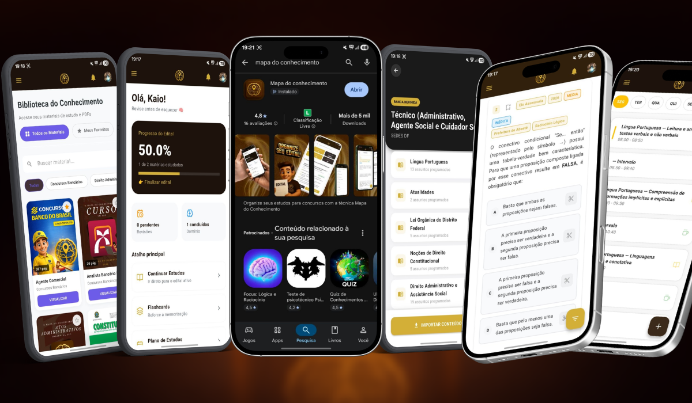

# 🗺️ Mapa do Conhecimento - Full-Stack SaaS Platform

> Plataforma SaaS focada em controle, organização e estudos para concursos públicos e vestibulares. Utiliza uma técnica exclusiva de mapeamento de conhecimento e centraliza toda a jornada do estudante em um único ambiente.

---

## 🚀 Visão Geral

O **Mapa do Conhecimento** é um ecossistema completo de estudos orientado por dados, projetado para resolver um problema crítico no pré e pós-edital:

> A maioria dos candidatos não sabe **o que estudar, quando estudar e como priorizar**.

A plataforma transforma desempenho em ações práticas, automatizando a tomada de decisão do aluno.

### Estrutura do Produto
- **📱 Mobile (Flutter):**
  - Banco de editais verticalizados
  - Cursos em PDF integrados à plataforma
  - Banco de questões com explicação  
  - Caderno de erros integrado  
  - Simulados inéditos e provas reais  
  - Organização e controle de estudos  
  - Flashcards  
  - Simulador de redação com técnica própria de correção  
- **🌐 Web:** Plataforma para estudos intensivos com leitura de PDFs, resolução de questões, análise de desempenho e gestão de assinaturas
- **⚙️ Backend Serverless:** Processamento, regras de negócio e segurança via Firebase

---

## 🧠 Diferencial Estratégico

O sistema aplica uma lógica proprietária de priorização baseada em desempenho:

- **< 50% de acerto:** Foco em vídeo aulas  
- **50% – 80%:** PDFs + reforço com flashcards  
- **> 80%:** Resolução intensiva de questões  

Isso elimina achismo e transforma dados em estratégia de estudo.

---

## 📊 Escala e Capacidade

- +400.000 questões estruturadas no banco de dados  
- Arquitetura preparada para alta concorrência  
- Sistema em modelo SaaS com monetização ativa  
- Suporte a múltiplas plataformas (Mobile + Web)

---

## 🛠️ Stack Tecnológica

### Front-end (Mobile & Web)
- **Flutter (Dart 3.3+)**
- Gerenciamento de estado com `Provider`
- Arquitetura modular e reativa
- UI baseada em design system (Figma)
- Animações com `flutter_animate`
- Renderização de PDFs via `Syncfusion`

### Back-end & Infraestrutura
- **Firebase (BaaS)**
- **Cloud Functions (Node.js)** para lógica crítica
- **Firestore (NoSQL)** com modelagem otimizada para grande volume de dados
- **Firebase Auth** (Email, Google, Facebook)

---

## 🔐 Segurança e Monetização

### 💳 Sistema de Pagamentos
- Integração com **Google Play Billing (Mobile)**
- Integração com **Stripe (Web)**
- Validação via **Webhooks + Cloud Functions**
- Sincronização automática de status premium entre plataformas

### 🛡️ Segurança de Dados
- Implementação de **RBAC (Role-Based Access Control)**
- Proteção contra elevação indevida de privilégios
- Apenas backend (Admin SDK) pode alterar dados sensíveis
- Regras robustas no Firestore garantindo isolamento de dados por usuário

---

## 🏗️ Desafios Técnicos Resolvidos

### 1. Performance em larga escala
- Estratégia de queries em “chunks” para evitar custos elevados no Firestore
- Otimização de leitura em base com centenas de milhares de registros

### 2. Arquitetura Offline-First
- Cache local com `shared_preferences`
- Otimização de assets com `cached_network_image`
- Sincronização eficiente de progresso

### 3. Escalabilidade
- Backend serverless com crescimento horizontal
- Baixo custo operacional mesmo com aumento de usuários

---

## 📱 Preview da Plataforma

  

---

## 🚀 Acesso ao Projeto

🔗 Site: https://mapadoconhecimento.com  
📱 App: https://play.google.com/store/apps/details?id=com.mapa.mapa

---

## 🔒 Sobre o Código

Este repositório apresenta a arquitetura e engenharia do sistema.  
O código-fonte é privado por se tratar de um produto comercial em operação.

---

## 📫 Contato

- LinkedIn: https://www.linkedin.com/in/kaio-da-silva-brito-959892385
[Portfólio Técnico (PDF)](assets/PORTIFOLIO_KAIO.pdf)
- Email: mapadoconhecimentoapp@gmail.com
